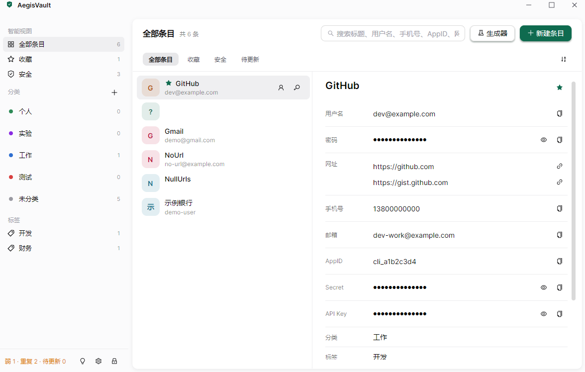
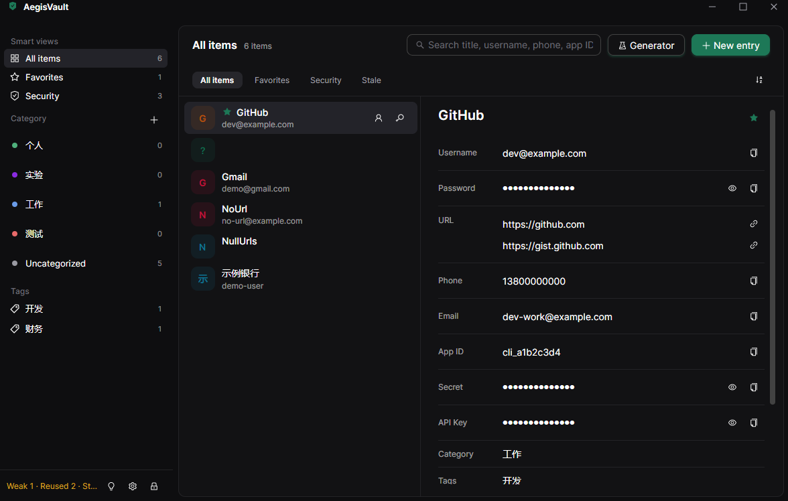
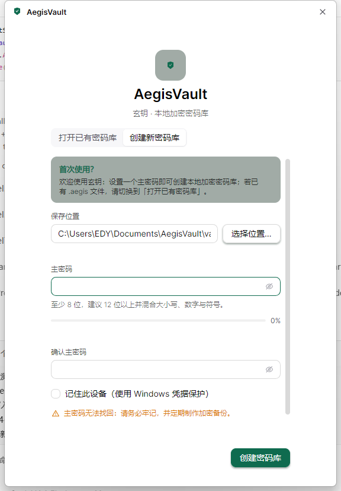
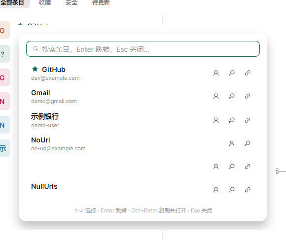
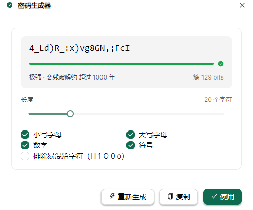
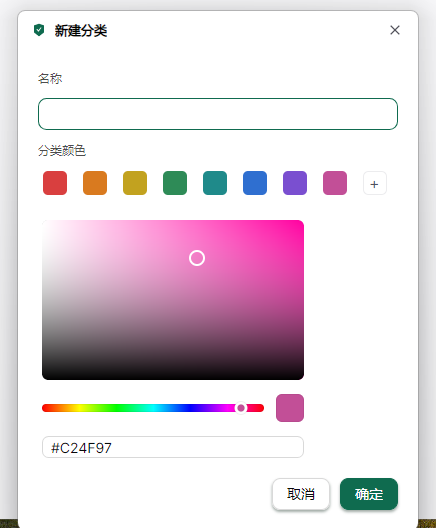

# AegisVault（玄钥）

**本地优先、零知识的跨平台密码管理器** — 基于 .NET 10 + Avalonia UI 构建，以金融级加密保护你的数字资产。

[](https://github.com/iamartinlong/AegisVault/actions/workflows/ci.yml)
[](LICENSE)


## 界面预览

| 主界面（浅色 · 中文） | 主界面（深色 · English） |
|---|---|
|  |  |

| 首次启动：创建密码库 | 快速访问浮层（`Ctrl+Shift+Space`） |
|---|---|
|  |  |

| 密码生成器 | 新建分类：8 预设色板 + 内嵌取色器 |
|---|---|
|  |  |

<sub>截图为演示数据（非真实凭据）；窗口按 100% 缩放采集，浅色/深色主题与中/英界面均受支持。</sub>

## 特性

- 🔐 **零知识加密**：主密码仅用于派生密钥，数据以 AES-256-GCM 逐条认证加密，密码库文件不含任何明文
- 🔄 **版本化数据迁移**：条目/设置负载带版本号并绑定 AAD；旧库解锁时自动归一化并一次性写回升级，旧版应用打开新库会明确报错（设计见 `docs/数据迁移设计.md`）
- 🧮 **现代密钥派生**：Argon2id（64 MiB / 3 轮，盐 16B）派生 KEK；分层密钥体系（KEK 包裹 DEK），改主密码无需全量重加密
- 🧠 **安全内存**：密钥存放于 libsodium 安全内存（`sodium_malloc` + 锁定 + 只读保护），退出/锁定时强制清零
- 📝 **条目管理**：标题/用户名/密码/网址/备注/标签/自定义字段，实时搜索、收藏置顶、预览与编辑分离；详情显示创建时间**与多条网址（逐条可点击打开）**；删除需确认；标题必填、网址自动补全并校验 http/https
- 🗂️ **分类 + 标签双模型**：分类为单归属（新建/重命名/删除，删除后条目转为未分类），标签可多维度交叉；左栏按 📁 分类 / # 标签 区分展示
- 🎨 **现代界面（Ink Green 主题）**：AtomUI 组件 + 设计 Token（盾绿主色、中性灰阶、8pt 间距），平面化三栏布局、检查器式详情、**浅色 / 深色 / 跟随系统 三态切换（按钮图标随模式变化）**
- ⏱️ **TOTP 验证码**：RFC 6238（SHA-1/256/512），倒计时展示与一键复制
- 🎲 **密码生成器**：长度/字符集/排除易混淆字符/熵强度预估
- 🔒 **自动锁定**：空闲超时（默认 5 分钟）、最小化、系统锁屏、挂起；锁定即清内存并显示遮罩，一键解锁
- 🖥️ **桌面集成**：系统托盘（打开/快速访问/设置/锁定/退出）、可选悬浮球、最小化到托盘
- ⚡ **快速访问**：`Ctrl+Shift+Space` 全局热键呼出浮层（Windows），搜索 + 键盘复制 + 跳转条目，`Ctrl+Enter` 一键复制密码并打开网址
- 🩺 **安全健康面板**：弱密码、跨条目复用与长期未更新（>1 年）检测，一键过滤问题条目
- 📥 **导入**：Bitwarden CSV 与通用格式（自动识别），后台导入
- 📋 **剪贴板保护**：复制密文后按配置延时自动清除（仅在内容未被替换时，且仅保留哈希指纹），带倒计时提示与"立即清除"
- 🌐 **多语言**：简体中文 / English（**主界面或设置内切换，可一键重启生效**；字符串表静态实现，AOT 安全）
- 🛡️ **防截屏**（Windows）：窗口内容排除在截屏/录屏之外（默认开启，可关闭）
- 💻 **记住设备**（Windows）：DPAPI 保护设备密钥，下次启动免密解锁；更换主密码即自动失效
- 🛡️ **进程硬化**：禁用核心转储（Windows `SetErrorMode` / Unix `setrlimit`）、锁屏/挂起监听
- ⌨️ **安全输入**（Windows，实验性）：系统安全桌面凭据对话框，阻断常规键盘记录
- 🚀 **NativeAOT 发布**：单文件原生可执行（Windows x64 实测约 47 MB），无需安装 .NET 运行时，启动快、内存占用低

## 技术栈

| 组件 | 选型 |
|---|---|
| 运行时 | .NET 10（NativeAOT） |
| UI | Avalonia 12.1 + AtomUI 6.1（Ant Design 6 风格组件） |
| MVVM | CommunityToolkit.Mvvm（源生成器，AOT 友好） |
| 存储 | SQLite（Microsoft.Data.Sqlite 10.0.12 + SQLitePCLRaw 2.1.12 / SQLite 3.53.3） |
| 密码学 | libsodium（Sodium.Core，Argon2id）+ BCL AES-256-GCM |
| 平台安全 | Windows DPAPI / CredUI（macOS Keychain、Linux libsecret 预留接口） |
| 测试 | xUnit（358 项：Core / Platform / Headless UI） |

## 快速开始

**前置要求**：.NET SDK 10.0.301+（Windows 上 NativeAOT 发布需要 VS Build Tools 的 C++ 工作负载）

```bash
# 构建
dotnet build -c Release

# 运行（开发）
dotnet run --project src/AegisVault.App

# 测试（358 项）
dotnet test -c Release

# NativeAOT 单文件发布（示例：Windows x64）
dotnet publish src/AegisVault.App/AegisVault.App.csproj -c Release -r win-x64 -p:PublishAot=true
```

首次使用：启动后在解锁窗口选择"创建新密码库"，设置主密码（至少 8 位，建议更强）。**主密码无法找回**，请务必牢记并做好加密备份。

> 参与开发前请先读 [`AGENTS.md`](AGENTS.md)：构建/测试门禁、硬性约束（数据迁移四件套、AtomUI 图标着色、滚动条留白等）与验证方式。

## 项目结构

```
AegisVault/
├─ src/
│  ├─ AegisVault.Core/        # 纯逻辑：密码学、加密 SQLite 存储、领域服务
│  ├─ AegisVault.Platform/    # 平台安全：DPAPI、CredUI、核心转储防护、会话监听
│  └─ AegisVault.App/         # Avalonia + AtomUI 桌面应用（MVVM）
├─ tests/
│  ├─ AegisVault.Core.Tests/      # 密码学 / 存储 / 服务单测（含 RFC 向量）
│  ├─ AegisVault.Platform.Tests/  # DPAPI 等平台能力
│  └─ AegisVault.App.Tests/       # ViewModel 与无头 UI 测试
├─ .github/workflows/         # CI（三端构建+测试）与 Release（三端 AOT 打包）
├─ assets/screenshots/        # README 界面截图（浅/深、中/英）
├─ AGENTS.md                  # 开发约定与硬性约束（贡献者/代理必读）
└─ THIRD-PARTY-NOTICES.md     # 第三方组件与许可证全文
```

## 安全设计

```
主密码 ──Argon2id(salt, m=64MiB, t=3)──▶ KEK ──AES-256-GCM──▶ 包裹 DEK
DEK(随机 32B) ──AES-256-GCM(每条目随机 nonce)──▶ 条目密文（AAD 绑定 id+版本）
```

- 头部参数（KDF 参数、盐等）参与 AAD，防降级/篡改；条目密文防换位重放
- 密码库为加密 SQLite 文件（`.aegis`），元数据不含秘密
- 解锁后仅解密到内存；锁定时清零会话密钥、清理剪贴板并关闭敏感窗口
- 详细审计记录见仓库提交历史与本地 `docs/`（规划、实施方案、可行性验证、三轮代码审计）

**已知局限**：Avalonia 文本输入返回托管字符串，无法主动清零（下个版本评估自定义安全输入控件）；主密码遗忘无法恢复（零知识设计）。

## 平台支持

| 平台 | 状态 |
|---|---|
| Windows 10/11 | 完整支持（DPAPI 记住设备、CredUI 安全输入、托盘、锁屏监听） |
| Linux | 构建/运行支持；托盘依赖 StatusNotifierItem（GNOME 需扩展） |
| macOS | 构建/运行支持；Keychain 集成在路线图中 |

## 路线图

- [x] M0–M7：工程基线、密码学内核、加密存储、核心服务、UI、桌面集成、安全硬化、CI/CD
- [x] P0–P3：解锁重构、三栏主窗口、快速访问/热键/悬浮球/防截屏、健康面板、CSV 导入、i18n 中英
- [ ] 自动填充（增强复制流 → 浏览器扩展）
- [ ] macOS Keychain / Linux libsecret 完整实现
- [ ] 附件、多库管理与同步
- [ ] 代码签名与 macOS 公证

## 许可证

- 本项目采用 **GPL-3.0** 开源，见 [LICENSE](LICENSE)
- 第三方组件（含 LGPL-3.0 的 AtomUI）及完整许可证文本见 [THIRD-PARTY-NOTICES.md](THIRD-PARTY-NOTICES.md)

## 安全披露

请勿在公开 Issue 中提交漏洞细节或真实密码库样本。发现安全问题请通过 GitHub Security Advisories（私有披露）联系维护者。
